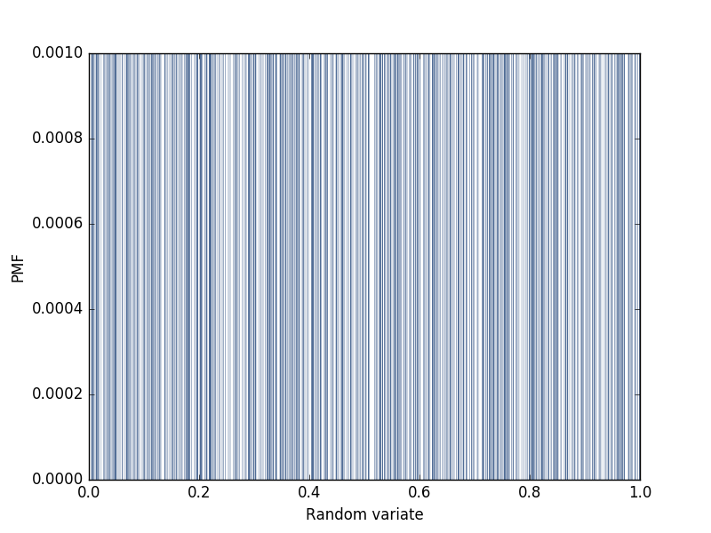
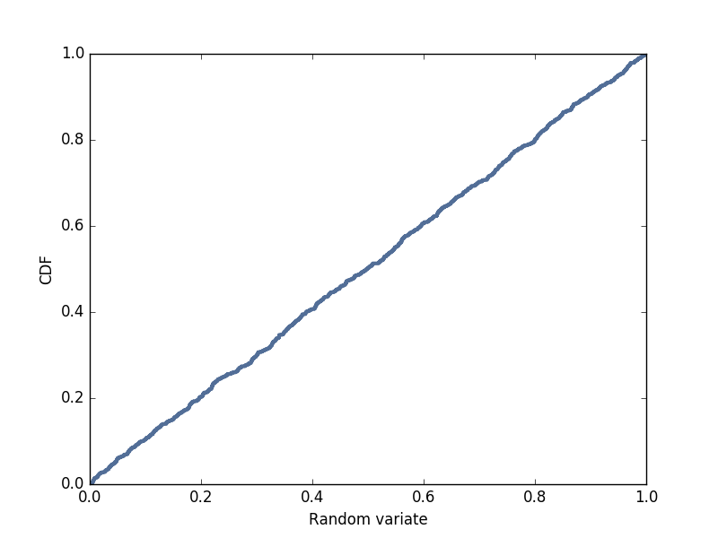

[Think Stats Chapter 4 Exercise 2](http://greenteapress.com/thinkstats2/html/thinkstats2005.html#toc41) (a random distribution)

## Think Stats
--- 

###Q3. Think Stats Chapter 4 Exercise 2 (random distribution)

This questions asks you to examine the function that produces random numbers. Is it really random? A good way to test that is to examine the pmf and cdf of the list of random numbers and visualize the distribution. If you're not sure what pmf is, read more about it in Chapter 3.

--- 

####Exercise 2   The numbers generated by random.random are supposed to be uniform between 0 and 1; that is, every value in the range should have the same probability.
Generate 1000 numbers from random.random and plot their PMF and CDF. Is the distribution uniform?

>> The probability mass function and the cumulative distrubtion functions are plotted below:  
>> 
Probability Mass Function of 1000 Randomly-Generated Numbers Between 0 and 1

Cumulative Density Function of 1000 Randomly-Generated Numbers Between 0 and 1

>> The distribution appears to be uniform, with relatively even probabilities of each number occurring in the probability density function, and a strong average slope that is indicative of a uniform distribution.
>> 
>> The cumulative distribution plot seems to make it much quicker to see that the distribution is uniform. However, the probability mass plot shows more detailed information showing that there is a more/less common number in sparse areas like 0.5 in this case.

