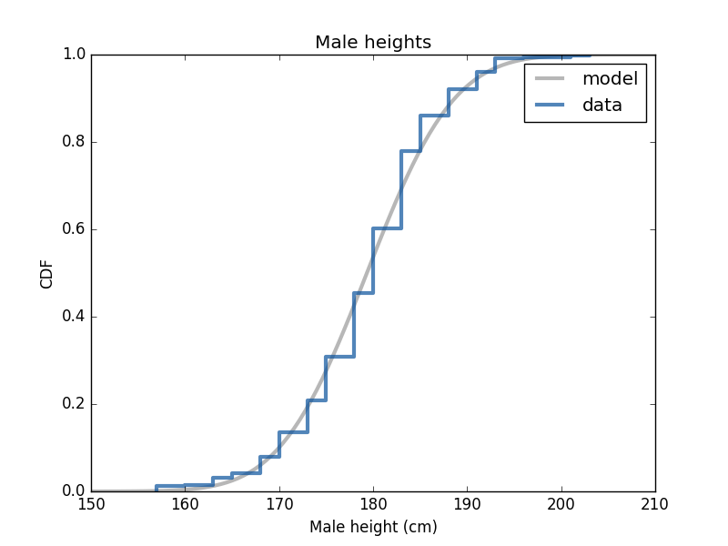

[Think Stats Chapter 5 Exercise 1](http://greenteapress.com/thinkstats2/html/thinkstats2006.html#toc50) (blue men)

## Think Stats
--- 

###Q4. Think Stats Chapter 5 Exercise 1 (normal distribution of blue men)

This is a classic example of hypothesis testing using the normal distribution. The effect size used here is the Z-statistic.

--- 

####Exercise 1   In the BRFSS (see Section 5.4), the distribution of heights is roughly normal with parameters µ = 178 cm and σ = 7.7 cm for men, and µ = 163 cm and σ = 7.3 cm for women.
In order to join Blue Man Group, you have to be male between 5’10” and 6’1” (see http://bluemancasting.com). What percentage of the U.S. male population is in this range? Hint: use scipy.stats.norm.cdf.

>> Using a normal distribution to describe male height and the collected data, it is expected that 38.05% of men in the U.S. are between 5'10" and 6'1".  
>>  
>> The following plot shows the collected data along with a normal distribution and shows that the collected data follows a normal distribution.

